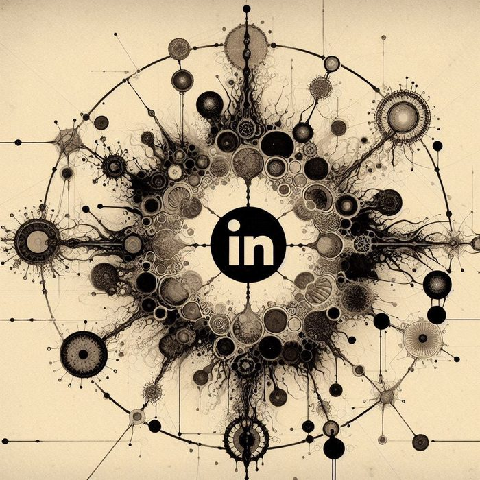
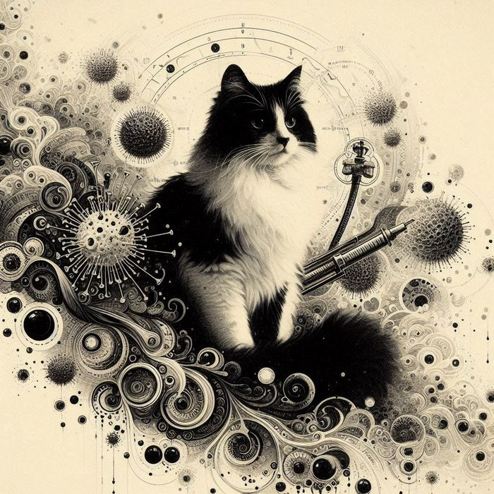

Akademik konularda görüş alışverişi, rehberlerle ilgili sorular ya da bir konuyu birlikte düşünmek istersen aşağıdaki kanallar açık.

```{=html}
<div class="contact-grid">

  <a class="contact-card" href="mailto:muammer.beslen@gmail.com" aria-label="E-mail">
    <picture>
      <source srcset="assets/contact/email.webp" type="image/webp"/>
      
    </picture>
  </a>

  <a class="contact-card" href="https://www.linkedin.com/in/muammer-beslen-78a59622b" target="_blank" rel="noopener" aria-label="LinkedIn">
    <picture>
      <source srcset="assets/contact/linkedin.webp" type="image/webp"/>
      
    </picture>
  </a>

  <a class="contact-card" href="https://github.com/drmuammer" target="_blank" rel="noopener" aria-label="GitHub">
    <picture>
      <source srcset="assets/contact/github.webp" type="image/webp"/>
      
    </picture>
  </a>

</div>
```

## Notlar

**Önce rehberlere bakmanı öneririm.** Çoğu metodolojik soru zaten [Projeler](projeler.qmd) sayfasındaki rehberlerde ele alınmıştır. Daha özel bir durum varsa e-mail at.

**Hata bildirimi.** Bir rehberde yanlış, eksik ya da muğlak bilgi gördüysen, ilgili GitHub repo'sunda **issue** açabilirsin. Hem benim için takip kolaylığı, hem diğer okurlar için fayda olur.
