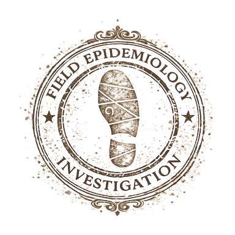

```{=html}
<section class="hero-banknote">

  <div class="hero-left">
    <div class="hero-side-label">EST · MMXXVI · ANKARA · OPEN SCIENCE</div>

    <div class="hero-content">
      <div class="hero-numeral-row">
        <div class="hero-numeral">001</div>
        <picture class="hero-seal">
          <source srcset="assets/seal-fetp.webp" type="image/webp"/>
          
        </picture>
      </div>

      <div class="hero-eyebrow">Field epidemiologist · Physician</div>
      <h1 class="hero-name">Muammer Beslen, MD</h1>
      <p class="hero-desc">
        Klinik araştırma metodolojisi, nedensel çıkarım ve sürveyans verisi üzerine çalışıyorum. Türkçe açık kaynak rehberler hazırlıyor, notlarımı paylaşıyorum.
      </p>

      <div class="hero-signature">
        <span class="hero-signature-text">M. Beslen</span>
      </div>
    </div>

    <div class="hero-foot">
      <div class="hero-links">
        <a href="https://linkedin.com/in/drmuammer" class="hero-link">LinkedIn</a>
        <a href="https://github.com/drmuammer" class="hero-link">GitHub</a>
        <a href="mailto:contact@muammerbeslen.com" class="hero-link">E-mail</a>
      </div>
      <div class="hero-serial">№ MB-001</div>
    </div>
  </div>

  <div class="hero-right">
    
  </div>

</section>
```
