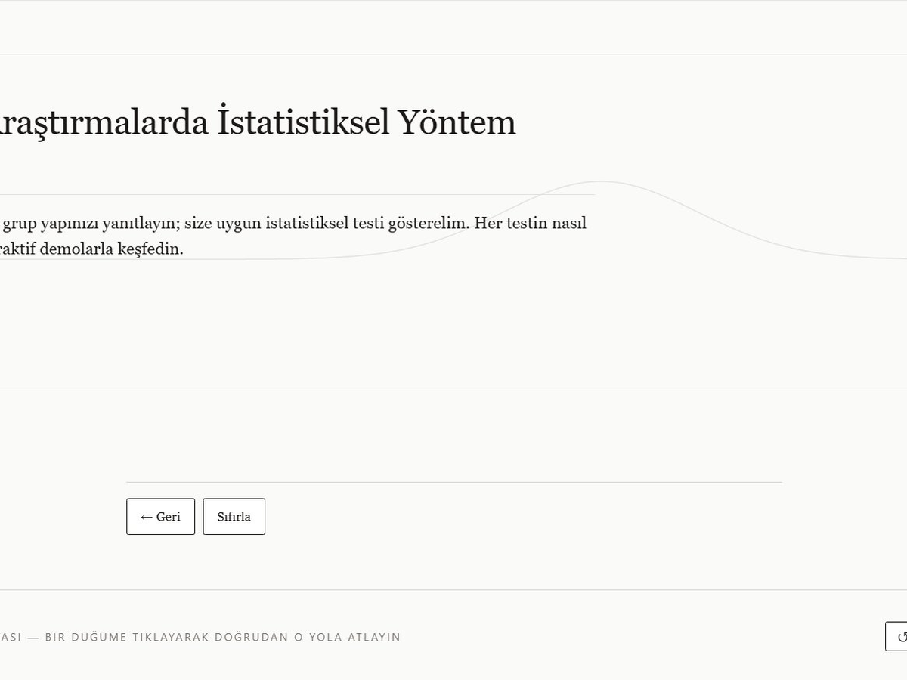
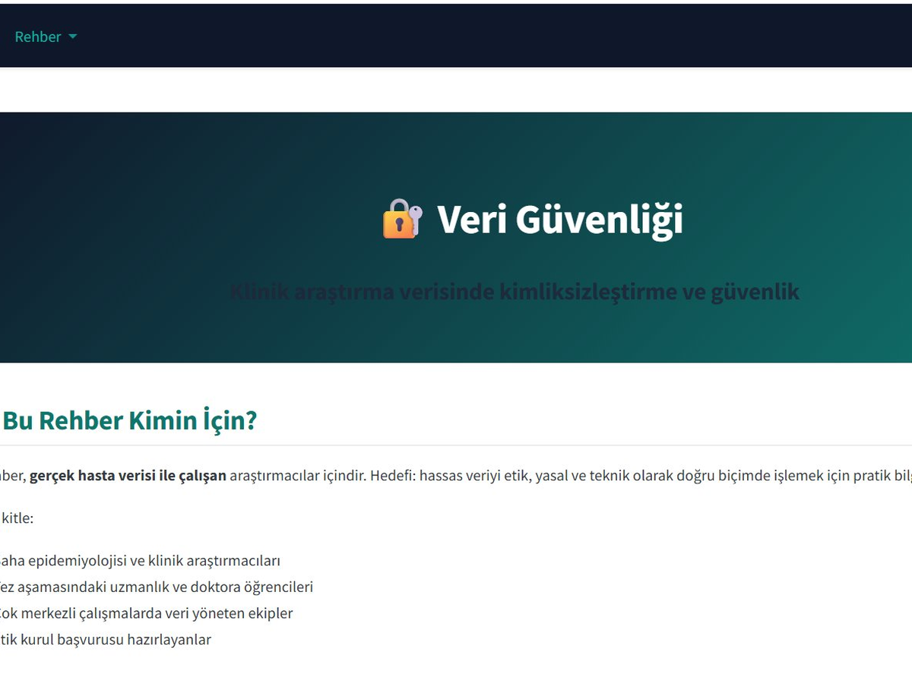
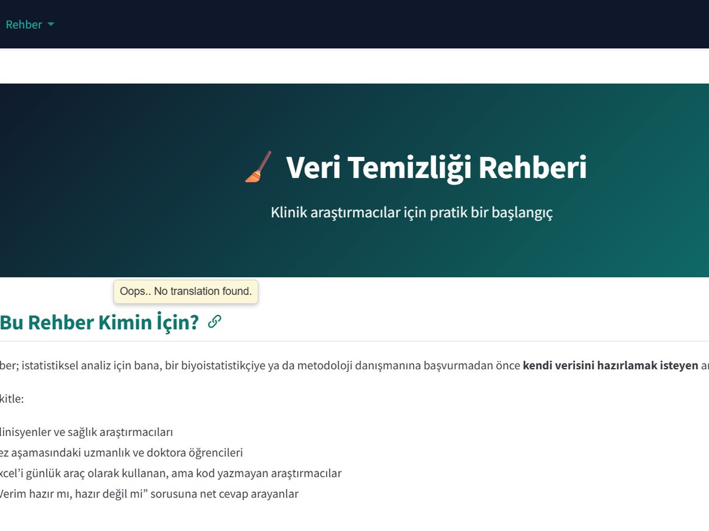
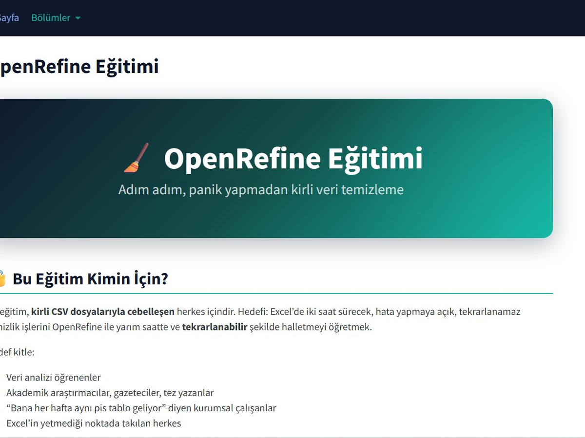
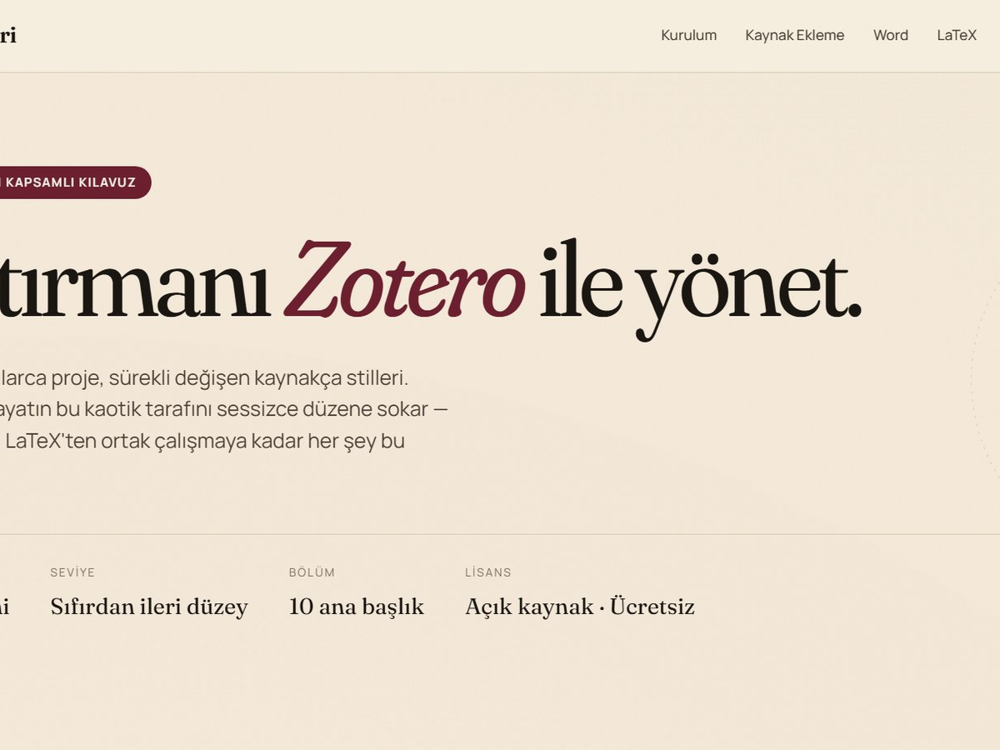

```{=html}
<div class="projects-intro">
  <p>Bu portfolyo, oluşturduğum açık kaynak rehberleri, araçları ve katkıda bulunduğum çalışmaları içerir. Tamamı GitHub'da, ücretsiz, atıflıdır.</p>
</div>

<div class="tm-grid">

  <a href="https://drmuammer.github.io/istatistik-yontem-secimi/" class="tm-card">
    <div class="tm-row tm-row-head">
      <div class="tm-cell"><span class="tm-mini">Proje</span><span class="tm-num">001</span></div>
      <div class="tm-cell tm-right"><span class="tm-mini">Durum</span><span class="tm-status">Aktif · 2025</span></div>
    </div>
    <div class="tm-row tm-row-title">
      <h3 class="tm-title">İstatistiksel Yöntem Seçimi</h3>
      <p class="tm-desc">Tıbbi araştırmada doğru istatistiksel testi bulmak için interaktif rehber. Sihirbaz, karar haritası, sürüklenebilir D3 demoları.</p>
    </div>
    <div class="tm-row tm-row-meta">
      <div class="tm-cell"><span class="tm-mini">Dil</span><span class="tm-val">TR · EN</span></div>
      <div class="tm-cell tm-right"><span class="tm-mini">Tür</span><span class="tm-val">İnteraktif</span></div>
    </div>
    <div class="tm-row tm-row-meta">
      <div class="tm-cell"><span class="tm-mini">Yapıldı</span><span class="tm-val">D3.js · Quarto</span></div>
      <div class="tm-cell tm-right"><span class="tm-mini">→</span><span class="tm-val tm-cta">Aç</span></div>
    </div>
    <div class="tm-cover">
      
    </div>
  </a>

  <a href="https://drmuammer.github.io/veri-seti-guvenligi/" class="tm-card">
    <div class="tm-row tm-row-head">
      <div class="tm-cell"><span class="tm-mini">Proje</span><span class="tm-num">002</span></div>
      <div class="tm-cell tm-right"><span class="tm-mini">Durum</span><span class="tm-status">Aktif · 2025</span></div>
    </div>
    <div class="tm-row tm-row-title">
      <h3 class="tm-title">Veri Güvenliği</h3>
      <p class="tm-desc">Klinik araştırma verisinde kimliksizleştirme, hashleme ve şifreleme. HIPAA, GDPR ve KVKK çerçevesinde 17 akademik kaynaklı kapsamlı doküman.</p>
    </div>
    <div class="tm-row tm-row-meta">
      <div class="tm-cell"><span class="tm-mini">Dil</span><span class="tm-val">TR</span></div>
      <div class="tm-cell tm-right"><span class="tm-mini">Tür</span><span class="tm-val">Akademik</span></div>
    </div>
    <div class="tm-row tm-row-meta">
      <div class="tm-cell"><span class="tm-mini">Kaynak</span><span class="tm-val">17 referans</span></div>
      <div class="tm-cell tm-right"><span class="tm-mini">→</span><span class="tm-val tm-cta">Aç</span></div>
    </div>
    <div class="tm-cover">
      
    </div>
  </a>

  <a href="https://drmuammer.github.io/veri-temizligi/" class="tm-card">
    <div class="tm-row tm-row-head">
      <div class="tm-cell"><span class="tm-mini">Proje</span><span class="tm-num">003</span></div>
      <div class="tm-cell tm-right"><span class="tm-mini">Durum</span><span class="tm-status">Aktif · 2025</span></div>
    </div>
    <div class="tm-row tm-row-title">
      <h3 class="tm-title">Veri Temizliği</h3>
      <p class="tm-desc">Klinik araştırmacılar için Excel/CSV tabanlı pratik veri temizleme rehberi. Eksik veri, yinelenenler, format düzeltmeleri.</p>
    </div>
    <div class="tm-row tm-row-meta">
      <div class="tm-cell"><span class="tm-mini">Dil</span><span class="tm-val">TR</span></div>
      <div class="tm-cell tm-right"><span class="tm-mini">Tür</span><span class="tm-val">Pratik</span></div>
    </div>
    <div class="tm-row tm-row-meta">
      <div class="tm-cell"><span class="tm-mini">Yapıldı</span><span class="tm-val">Excel · CSV</span></div>
      <div class="tm-cell tm-right"><span class="tm-mini">→</span><span class="tm-val tm-cta">Aç</span></div>
    </div>
    <div class="tm-cover">
      
    </div>
  </a>

  <a href="https://drmuammer.github.io/openrefine-pratik/" class="tm-card">
    <div class="tm-row tm-row-head">
      <div class="tm-cell"><span class="tm-mini">Proje</span><span class="tm-num">004</span></div>
      <div class="tm-cell tm-right"><span class="tm-mini">Durum</span><span class="tm-status">Aktif · 2025</span></div>
    </div>
    <div class="tm-row tm-row-title">
      <h3 class="tm-title">OpenRefine Pratik</h3>
      <p class="tm-desc">OpenRefine ile pratik veri temizliği — kümeleme algoritmaları, normalizasyon, GREL dönüşümleri ve gerçek dünya örnekleri.</p>
    </div>
    <div class="tm-row tm-row-meta">
      <div class="tm-cell"><span class="tm-mini">Dil</span><span class="tm-val">TR</span></div>
      <div class="tm-cell tm-right"><span class="tm-mini">Tür</span><span class="tm-val">Pratik</span></div>
    </div>
    <div class="tm-row tm-row-meta">
      <div class="tm-cell"><span class="tm-mini">Yapıldı</span><span class="tm-val">OpenRefine · GREL</span></div>
      <div class="tm-cell tm-right"><span class="tm-mini">→</span><span class="tm-val tm-cta">Aç</span></div>
    </div>
    <div class="tm-cover">
      
    </div>
  </a>

  <a href="https://drmuammer.github.io/zotero-rehberi/" class="tm-card">
    <div class="tm-row tm-row-head">
      <div class="tm-cell"><span class="tm-mini">Proje</span><span class="tm-num">005</span></div>
      <div class="tm-cell tm-right"><span class="tm-mini">Durum</span><span class="tm-status">Aktif · 2025</span></div>
    </div>
    <div class="tm-row tm-row-title">
      <h3 class="tm-title">Zotero Rehberi</h3>
      <p class="tm-desc">Akademisyenler için kapsamlı Zotero kılavuzu — kurulum, Word & LaTeX entegrasyonu, atıf stilleri, grup kütüphaneleri.</p>
    </div>
    <div class="tm-row tm-row-meta">
      <div class="tm-cell"><span class="tm-mini">Dil</span><span class="tm-val">TR</span></div>
      <div class="tm-cell tm-right"><span class="tm-mini">Tür</span><span class="tm-val">Akademik</span></div>
    </div>
    <div class="tm-row tm-row-meta">
      <div class="tm-cell"><span class="tm-mini">Yapıldı</span><span class="tm-val">Zotero · BibTeX</span></div>
      <div class="tm-cell tm-right"><span class="tm-mini">→</span><span class="tm-val tm-cta">Aç</span></div>
    </div>
    <div class="tm-cover">
      
    </div>
  </a>

  <a href="https://github.com/drmuammer" class="tm-card tm-card-more">
    <div class="tm-row tm-row-head">
      <div class="tm-cell"><span class="tm-mini">Daha</span><span class="tm-num">+</span></div>
      <div class="tm-cell tm-right"><span class="tm-mini">GitHub</span><span class="tm-status">Açık</span></div>
    </div>
    <div class="tm-row tm-row-title">
      <h3 class="tm-title">Daha fazlası GitHub'da</h3>
      <p class="tm-desc">Yeni rehberler ve mini araçlar GitHub profilinde yayınlanmaya devam ediyor. Notlar, dersler, mini analiz örnekleri.</p>
    </div>
    <div class="tm-row tm-row-meta">
      <div class="tm-cell"><span class="tm-mini">Hesap</span><span class="tm-val">@drmuammer</span></div>
      <div class="tm-cell tm-right"><span class="tm-mini">→</span><span class="tm-val tm-cta">İncele</span></div>
    </div>
    <div class="tm-cover tm-cover-empty">
      <div class="tm-more-icon">→</div>
    </div>
  </a>

</div>
```
